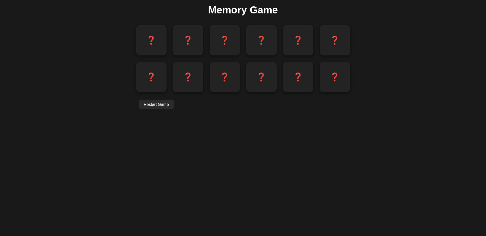

# Memory Card Game

A fun, interactive Memory Card Game built with React. Flip cards to find matching pairs and challenge your memory! This project features a dark theme and is fully responsive for mobile, tablet, laptop, and desktop.

## Features

* Flip cards to find matching pairs
* Only two cards can be flipped at a time
* Matches stay revealed; non-matches flip back automatically
* Tracks game completion and shows a win alert
* Restart button to shuffle and reset the game
* Dark theme and modern styling
* Fully responsive layout for all devices

## Technologies Used

* React (functional components and hooks)
* CSS Grid for responsive layout
* useState and useEffect for game logic

## Installation

1. Clone the repository
2. Navigate to the project folder
3. Install dependencies using `npm install`
4. Start the development server using `npm start`
5. Open `http://localhost:3000` in your browser

## Usage

* Click on cards to flip them
* Find pairs of matching cards
* The game ends when all pairs are matched
* Click "Restart Game" to start a new shuffled game

## Folder Structure

```
src/
├── components/
│   └── Card.jsx          # Card component
├── App.jsx               # Main app component
├── App.css               # Dark-themed responsive CSS
└── main.jsx              # React entry point
```

## Screenshots



## License

This project is open source and available under the MIT License.